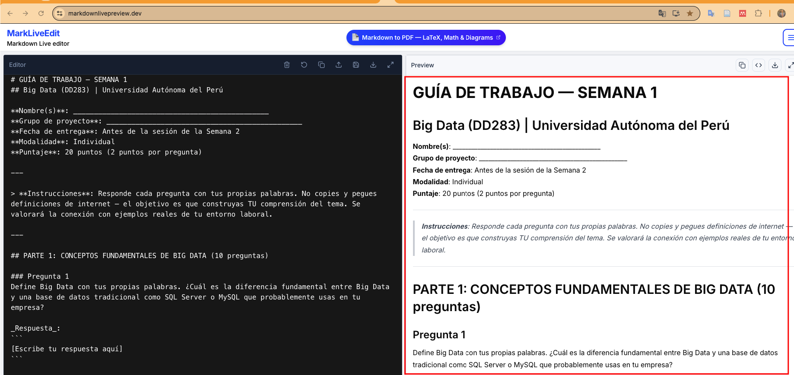

# GUIA COMPLETA DE GITHUB — Big Data DD283
## Universidad Autónoma del Perú | 2026-1

> **Docente**: RubenCarty | **Repo del curso**: github.com/RubenCarty/bigdata-ua-2026-1

---

## ARQUITECTURA DEL CURSO EN GITHUB

```
REPO DEL CURSO (actividades individuales)          REPOS DE PROYECTOS (1 por grupo)
github.com/RubenCarty/bigdata-ua-2026-1            github.com/lider-grupo/nombre-proyecto
        │                                                    │
        │ Fork (cada estudiante, 1 vez)                      │ Colaboradores (todos del grupo)
        ▼                                                    ▼
github.com/alumno/bigdata-ua-2026-1               Cada integrante clona y trabaja
        │                                          en ramas dentro del mismo repo
        │ Pull Request cada semana
        ▼
El docente revisa, da feedback y hace merge
```

**Resumen de la separación:**
- `bigdata-ua-2026-1` → actividades individuales (labs + guías semanales)
- Un repo aparte por cada grupo → desarrollo del proyecto semestral

---

# SECCION A — GUIA DEL DOCENTE

## A1. Publicar materiales nuevos cada semana

Cuando preparas los materiales de una nueva semana (guías, notebooks, slides), usa estos comandos:

```bash
# 1. Posicionarte en el repo del curso
cd "/Users/rubenquispellacctarimay/My Drive/U. Autónoma 2026-1/Big Data/GitHub_Repo/bigdata-ua-2026-1"
# Para qué: Git solo funciona desde dentro de la carpeta del repositorio

# 2. Ver qué archivos cambiaron o agregaste
git status
# Para qué: muestra en rojo los archivos nuevos/modificados aún no guardados en Git
# Si dice "nothing to commit" → Git no detecta cambios (carpetas vacías o archivos ya guardados)

# 3. Preparar todos los cambios para guardar
git add .
# Para qué: selecciona TODOS los archivos modificados/nuevos para el próximo guardado
# Alternativa si quieres ser específico: git add semana_02/

# 4. Guardar con mensaje descriptivo
git commit -m "feat: agrego materiales semana 2 - Hadoop y PySpark"
# Para qué: crea un "checkpoint" permanente en el historial de Git
# El mensaje debe decir QUÉ agregaste para que los estudiantes entiendan

# 5. Subir a GitHub (publicar para que los estudiantes lo vean)
git push origin main
# Para qué: envía tus commits guardados localmente al servidor de GitHub
# origin = tu repositorio en GitHub
# main = la rama principal del curso
```

**Regla de oro:** si ves `Everything up-to-date` en el push, los cambios ya estaban subidos. Si ves el porcentaje de transferencia, se está subiendo.

---

## A2. Traer cambios del remoto a tu local

Necesitas hacer esto cuando hiciste un merge de un PR de estudiante desde GitHub web, o cuando trabajas desde otra computadora:

```bash
# Descargar los commits más recientes de GitHub a tu laptop
git pull origin main
# Para qué: sincroniza tu copia local con lo que está en GitHub
# Siempre hacer esto ANTES de empezar a trabajar para evitar conflictos
```

---

## A3. Revisar y calificar las entregas de estudiantes

```
1. Ir a: github.com/RubenCarty/bigdata-ua-2026-1 → tab "Pull requests"
2. Verás todos los PRs pendientes de los estudiantes
3. Clic en un PR para abrirlo
4. Tab "Files changed" → ver exactamente qué entregó el estudiante
5. Para comentar una línea específica: clic en el "+" que aparece al pasar el cursor
6. Para dar feedback general: tab "Conversation" → dejar comentario

Para calificar:
  - "Review changes" → Approve    → trabajo aprobado (nota OK)
  - "Review changes" → Request changes → pedir correcciones antes de nota
  - "Merge pull request" → incorporar la entrega al repo oficial del curso
```

**Tipos de comentarios recomendados:**
```
✅ Excelente! El análisis de las 5 V's está correcto y bien justificado.
⚠️ La reflexión es muy corta. Amplía la conexión con tu empresa actual.
💡 Tip: df.groupby('col').agg(['sum','mean']) es más eficiente que tu loop.
❌ El notebook tiene errores en celda 7. Corrígelo y haz push nuevamente.
```

---

## A4. Configurar protección de main (hacer una vez)

```
GitHub → tu repo → Settings → Branches → Add branch ruleset
  - Branch name: main
  - Require a pull request before merging: ON
  - Required approvals: 1
→ Guardar

Para qué: impide que estudiantes committeen directo a main.
Deben pasar por PR para que tú puedas revisar.
```

---

# SECCION B — GUIA DEL ESTUDIANTE (PASO A PASO)

## FASE 0: Configuración inicial (solo UNA VEZ en todo el semestre)

### Paso 0.1 — Crear cuenta en GitHub

```
1. Ir a: github.com → Sign Up
2. Nombre de usuario: usar apellido + nombre (ejemplo: lopez-maria)
3. Verificar email
```

### Paso 0.2 — Hacer Fork del repo del docente

```
1. Ir a: github.com/RubenCarty/bigdata-ua-2026-1
2. Clic en el botón "Fork" (arriba a la derecha)
3. Dejar todo como está → clic "Create fork"
4. Resultado: ahora tienes TU PROPIA COPIA en:
   github.com/TU-USUARIO/bigdata-ua-2026-1

Para qué: Fork crea una copia del repo del docente en tu cuenta.
Tú trabajas en tu copia y envías tus tareas al docente vía Pull Request.
```

### Paso 0.3 — Instalar Git en tu laptop

```
Windows: descargar desde git-scm.com → instalar con opciones por defecto
Mac: abrir Terminal → escribir: git --version
     Si no está instalado, Mac pregunta si instalarlo → aceptar
Linux: sudo apt install git
```

### Paso 0.4 — Clonar tu fork a tu laptop

Abre una terminal (en Mac: busca "Terminal"; en Windows: busca "Git Bash"):

```bash
# Clonar TU fork (no el repo del docente, sino TU copia)
git clone https://github.com/TU-USUARIO/bigdata-ua-2026-1.git
# Para qué: descarga todos los archivos del repo a tu computadora
# Reemplaza TU-USUARIO con tu nombre de usuario de GitHub

# Entrar a la carpeta descargada
cd bigdata-ua-2026-1
# Para qué: entrar a la carpeta. Git solo funciona desde adentro del repo
```

### Paso 0.5 — Conectar con el repo del docente

```bash
# Agregar el repo del docente como fuente de actualizaciones
git remote add upstream https://github.com/RubenCarty/bigdata-ua-2026-1.git
# Para qué: crea un "canal" llamado upstream que apunta al repo original del docente
# Así podrás descargar los materiales nuevos que el docente publique cada semana

# Verificar que quedó bien configurado
git remote -v
# Debe mostrar exactamente esto:
# origin    https://github.com/TU-USUARIO/bigdata-ua-2026-1.git (fetch)
# origin    https://github.com/TU-USUARIO/bigdata-ua-2026-1.git (push)
# upstream  https://github.com/RubenCarty/bigdata-ua-2026-1.git (fetch)
# upstream  https://github.com/RubenCarty/bigdata-ua-2026-1.git (push)
#
# origin   = tu fork (donde subes TU trabajo)
# upstream = repo del docente (de donde descargas materiales nuevos)
```

### Paso 0.6 — Configurar tu identidad en Git

```bash
git config user.name "Juan Lopez"
git config user.email "tu.email@gmail.com"
# Para qué: cada commit quedará firmado con tu nombre. El docente sabrá quién hizo qué.
```

---

## FASE 1: Inicio de cada semana (SIEMPRE hacer primero)

Al inicio de cada semana de clases, antes de empezar a trabajar:

```bash
# Volver a la rama principal
git checkout main
# Para qué: asegurarte de estar en la base correcta antes de sincronizar

# Descargar los materiales nuevos que publicó el docente
git pull upstream main
# Para qué: trae a tu laptop las guías de trabajo, notebooks y slides de la semana nueva
# Si ves "Already up to date" → el docente no publicó nada nuevo aún

# Actualizar también tu copia en GitHub
git push origin main
# Para qué: tu fork en GitHub también queda actualizado con los materiales nuevos
```

---

## FASE 2: Trabajar en las actividades de la semana

### Paso 2.1 — Crear tu rama personal

```bash
# Crear tu rama de trabajo para esta semana
git checkout -b semana-01-lopez-maria
# Para qué: crea una "línea de trabajo paralela" solo para ti
# NUNCA trabajes directamente en main → siempre crear una rama nueva

# FORMATO OBLIGATORIO: semana-NN-apellido-nombre
# Ejemplos correctos:
#   semana-01-garcia-pedro
#   semana-02-mamani-julia
#   semana-03-torres-carlos
# Sin espacios, sin tildes, todo en minúsculas

# Verificar que estás en tu nueva rama
git branch
# El asterisco (*) indica la rama activa
# * semana-01-lopez-maria   ← correcto
```

### Paso 2.2 — Completar las actividades

```
Actividades de cada semana:
1. GUIA DE TRABAJO: responder las preguntas teóricas (archivo .md)
2. GUIA DE LABORATORIO: ejecutar el notebook completo (archivo .ipynb)

Dónde guardar tus respuestas:
semana_01/Solucion_S1/lopez_maria/GUIA_TRABAJO_S1_lopez.md
semana_01/Solucion_S1/lopez_maria/LABORATORIO_S1_lopez.ipynb

Reemplaza "lopez_maria" con tu apellido_nombre (sin espacios, sin tildes)
```

### Paso 2.3 — Guardar tu progreso (hacer varias veces mientras trabajas)

```bash
# Ver qué archivos modificaste
git status
# Para qué: muestra en rojo los archivos modificados que aún no guardaste en Git

# Agregar tus archivos
git add semana_01/Solucion_S1/lopez_maria/
# Para qué: selecciona TUS archivos para el próximo guardado
# Usa tu carpeta específica para no afectar los archivos de otros

# Guardar con mensaje descriptivo
git commit -m "[S01] guia de trabajo y lab completados - Lopez Maria"
# Para qué: crea un punto de guardado permanente con tu mensaje
# FORMATO: [S0N] descripcion - Apellido Nombre
```

### Paso 2.4 — Subir tu trabajo a GitHub

```bash
# Subir tu rama con tu trabajo a tu fork en GitHub
git push origin semana-01-lopez-maria
# Para qué: sube tus commits al servidor de GitHub
# origin = tu fork personal
# semana-01-lopez-maria = tu rama con tu trabajo
```

---

## FASE 3: Crear el Pull Request (la entrega oficial)

Esta es tu entrega formal — el docente la ve y califica aquí:

```
1. Ir a: github.com/TU-USUARIO/bigdata-ua-2026-1
2. Aparece un banner amarillo: "semana-01-lopez-maria had recent pushes"
   → Clic en "Compare & pull request"

3. VERIFICAR que apunta al lugar correcto:
   base repository: RubenCarty/bigdata-ua-2026-1    base: main    ← repo del DOCENTE
   head repository: TU-USUARIO/bigdata-ua-2026-1    compare: semana-01-lopez-maria

4. Título del PR: [S01] Entrega Lab Semana 1 - Lopez Maria

5. Completar el formulario automático:
   - Nombre completo
   - Semana que entregas
   - Qué aprendiste
   - Conexión con tu trabajo actual en empresa
   - Dificultades que tuviste
   - Preguntas para el docente

6. Clic: "Create pull request"

7. Copiar el link del PR y pegarlo en el aula virtual / WhatsApp del curso
```

---

## FASE 4: Responder al feedback del docente

El docente puede pedir correcciones. Si eso pasa:

```bash
# 1. Leer los comentarios del docente en GitHub

# 2. Hacer las correcciones en tu laptop

# 3. Guardar y subir (el PR se actualiza automáticamente)
git add semana_01/Solucion_S1/lopez_maria/
git commit -m "[S01] correcciones según feedback del docente - Lopez Maria"
git push origin semana-01-lopez-maria
# El PR en GitHub se actualiza solo — no necesitas crear uno nuevo
```

---

## RESUMEN SEMANAL — Los 6 comandos de cada semana

```bash
# ━━━━━━━━━━━━━━━━━━━━━━━━━━━━━━━━━━━━━━━━━━━━━━━━━━━━━━
# INICIO DE SEMANA (sincronizar materiales del docente)
git checkout main
git pull upstream main
git push origin main

# CREAR TU RAMA
git checkout -b semana-NN-apellido-nombre

# TRABAJAR... completar guía y lab

# GUARDAR Y SUBIR
git add semana_0N/Solucion_SN/apellido_nombre/
git commit -m "[S0N] actividades completas - Apellido Nombre"
git push origin semana-NN-apellido-nombre
# → Ir a GitHub → crear Pull Request
# ━━━━━━━━━━━━━━━━━━━━━━━━━━━━━━━━━━━━━━━━━━━━━━━━━━━━━━
```

---

# SECCION C — PROYECTO GRUPAL (Semanas 1-8)

## Buena práctica: repos SEPARADOS por grupo

El repo `bigdata-ua-2026-1` es SOLO para actividades individuales semanales.
Cada grupo de proyecto crea su PROPIO repositorio separado.

**Por qué separado:**
- El repo del curso no se mezcla con código de proyectos
- El grupo tiene control total de su repo
- Fácil de gestionar permisos (todos son colaboradores directos)
- El docente entra como colaborador o revisa el repo público

---

## C1. El líder del grupo crea el repo del proyecto (solo una vez)

```
1. Ir a github.com → clic en "+" (arriba) → "New repository"
2. Configurar:
   - Repository name: bigdata-ua-[nombre-proyecto]-grupo[N]
     Ejemplos: bigdata-ua-fraude-bancario-grupo1
               bigdata-ua-churn-telecom-grupo2
               bigdata-ua-trafico-lima-grupo3
   - Description: "Proyecto Big Data: [nombre] — DD283 UA Perú 2026-1"
   - Visibility: Public (para que el docente pueda verlo sin invitación)
   - Add a README file: YES
3. Clic "Create repository"

4. Invitar a los compañeros del grupo:
   Settings → Collaborators → Add people → buscar usuario de GitHub de cada integrante
   → cada integrante acepta la invitación por email
```

---

## C2. Cada integrante configura el repo del proyecto (una vez)

```bash
# Clonar el repo del proyecto (NO hacer fork, clonar directo)
git clone https://github.com/LIDER-GRUPO/bigdata-ua-fraude-bancario-grupo1.git
cd bigdata-ua-fraude-bancario-grupo1

# Configurar identidad (si no lo hiciste ya)
git config user.name "Tu Nombre"
git config user.email "tu@email.com"
```

---

## C3. Flujo de trabajo del grupo cada semana

Cada integrante trabaja en su propia rama dentro del repo del proyecto:

```bash
# Crear tu rama para la parte que te corresponde
git checkout -b feature/ingesta-datos-lopez
git checkout -b feature/modelo-ml-garcia
git checkout -b feature/dashboard-torres
git checkout -b feature/mongodb-mamani

# Trabajar en tu parte del proyecto...

# Guardar y subir
git add .
git commit -m "feat: implementar pipeline de ingesta con Kafka - Lopez"
git push origin feature/ingesta-datos-lopez

# Crear PR DENTRO del repo del proyecto:
# → github.com/LIDER/repo-proyecto → "Compare & pull request"
# → base: main | compare: feature/ingesta-datos-lopez
# → El LÍDER del grupo revisa y aprueba el merge
```

---

## C4. El líder del grupo gestiona el repo

```
Responsabilidades del líder:
  - Revisar y mergear los PRs de los compañeros
  - Mantener el README actualizado con el progreso
  - Invitar al docente como colaborador (Settings → Collaborators)
  - Crear tag de release para las sustentaciones EP y EF:
    GitHub → Releases → "Create a new release"
    Tag: v1.0-EP  (semana 4, sustentación EP)
    Tag: v2.0-EF  (semana 8, sustentación EF)
```

---

## C5. Estructura de carpetas del proyecto

```
bigdata-ua-[nombre-proyecto]-grupo[N]/
├── README.md                      ← descripción completa del proyecto
├── notebooks/
│   ├── 01_EDA_exploracion.ipynb       ← Semana 1-2: Análisis exploratorio
│   ├── 02_pipeline_hadoop.ipynb       ← Semana 2-3: Procesamiento Hadoop/Spark
│   ├── 03_nosql_mongodb.ipynb         ← Semana 3: Base de datos NoSQL
│   ├── 04_spark_procesamiento.ipynb   ← Semana 5: Spark avanzado
│   ├── 05_modelo_ml.ipynb             ← Semana 6: Modelo Machine Learning
│   ├── 06_scraping_calidad.ipynb      ← Semana 7: Scraping y calidad de datos
│   └── 07_dashboard_final.ipynb       ← Semana 8: Visualización final
├── src/
│   ├── pipeline_ingesta.py
│   ├── transformaciones.py
│   └── modelo_ml.py
├── data/
│   ├── README_datos.md                ← Descripción de los datos y links de descarga
│   └── sample/                        ← Solo muestra pequeña (máximo 5MB)
├── docs/
│   ├── arquitectura.png               ← Diagrama de arquitectura del sistema
│   ├── presentacion_EP_semana4.pdf    ← Slides sustentación EP
│   └── presentacion_EF_semana8.pdf   ← Slides sustentación EF
├── .gitignore
└── requirements.txt
```

---

## C6. Compartir el link del proyecto con el docente

Cada semana el líder debe actualizar el tracker de progreso en el README:

```markdown
## Progreso del Proyecto

| Semana | Entregable | Responsable | Estado |
|--------|-----------|-------------|--------|
| S1 | EDA + Arquitectura propuesta | Lopez | ✅ Completado |
| S2 | Pipeline Hadoop/Spark | Garcia | 🔄 En progreso |
| S3 | Implementación MongoDB | Torres | ⬜ Pendiente |
| S4 | **Sustentación EP** | Todos | ⬜ Pendiente |
| S5 | Spark SQL + Streaming | Lopez | ⬜ Pendiente |
| S6 | Modelo ML entrenado | Garcia | ⬜ Pendiente |
| S7 | Scraping + Calidad datos | Torres | ⬜ Pendiente |
| S8 | **Sustentación EF** | Todos | ⬜ Pendiente |
```

---

# SECCION D — COMANDOS DE EMERGENCIA

### "Git no detecta mis archivos nuevos" (git status dice nothing to commit)
```bash
# Problema: la carpeta está vacía — Git no rastrea carpetas vacías
# Solución: crear un archivo dentro de la carpeta
touch semana_01/Solucion_S1/apellido_nombre/.gitkeep
git add .
git commit -m "fix: agregar archivo para que Git rastree la carpeta"
```

### "Olvidé en qué rama estoy"
```bash
git branch          # el asterisco (*) indica la rama activa
git status          # también muestra la rama actual al inicio
```

### "Quiero deshacer cambios que aún NO hice commit"
```bash
git restore nombre_archivo.ipynb    # deshacer cambios en un archivo
git restore .                       # deshacer TODOS los cambios (cuidado)
```

### "El docente subió materiales nuevos pero yo ya estaba trabajando"
```bash
git stash                           # guardar mis cambios temporalmente
git pull upstream main              # descargar los nuevos materiales
git stash pop                       # recuperar mis cambios
```

### "Conflict: merge conflict"
```bash
# Git marca el conflicto en el archivo así:
# <<<<<<< HEAD
# Tu versión del código
# =======
# Versión del repo original
# >>>>>>> upstream/main
#
# Editar el archivo: eliminar las marcas y quedarte con la versión correcta
# Luego:
git add archivo_con_conflicto
git commit -m "fix: resolver conflicto de merge"
```

---

# SECCION E — REFERENCIA RAPIDA

## Comandos diarios

| Qué quiero hacer | Comando |
|-----------------|---------|
| Ver qué cambié | `git status` |
| Ver historial | `git log --oneline` |
| Crear rama nueva | `git checkout -b nombre-rama` |
| Cambiar de rama | `git checkout nombre-rama` |
| Ver mis ramas | `git branch` |
| Preparar archivos | `git add .` |
| Guardar | `git commit -m "mensaje"` |
| Subir a GitHub | `git push origin mi-rama` |
| Bajar del docente | `git pull upstream main` |
| Bajar de mi fork | `git pull origin main` |

## Formato de mensajes de commit

```
[S01] lab completado - Lopez Maria           ← actividad semanal
feat: implementar detección de fraude        ← nueva funcionalidad del proyecto
fix: corregir error en pipeline de ingesta   ← corrección de bug
docs: actualizar README con instrucciones    ← documentación
```

## Convención de nombres de ramas

```
semana-01-lopez-maria          ← actividad individual semana 1
semana-02-garcia-pedro         ← actividad individual semana 2
feature/modelo-ml-torres       ← funcionalidad del proyecto grupal
fix/error-conexion-mongodb     ← corrección en el proyecto
```

---

```
╔══════════════════════════════════════════════════════════════╗
║       FLUJO SEMANAL RESUMIDO — BIG DATA DD283                ║
╠══════════════════════════════════════════════════════════════╣
║                                                              ║
║  INICIO:                                                     ║
║  git checkout main                                           ║
║  git pull upstream main        ← materiales del docente      ║
║  git checkout -b semana-NN-apellido                          ║
║                                                              ║
║  TRABAJANDO:                                                 ║
║  git add semana_0N/Solucion_SN/apellido/                     ║
║  git commit -m "[S0N] descripcion - Apellido"                ║
║                                                              ║
║  ENTREGA:                                                    ║
║  git push origin semana-NN-apellido                          ║
║  → GitHub → "Compare & pull request" → completar → Crear    ║
║  → Compartir link del PR con el docente                      ║
║                                                              ║
╚══════════════════════════════════════════════════════════════╝
```

---

*Universidad Autónoma del Perú | Big Data DD283 | 2026-1*
*Dudas: abrir un Issue en github.com/RubenCarty/bigdata-ua-2026-1*
